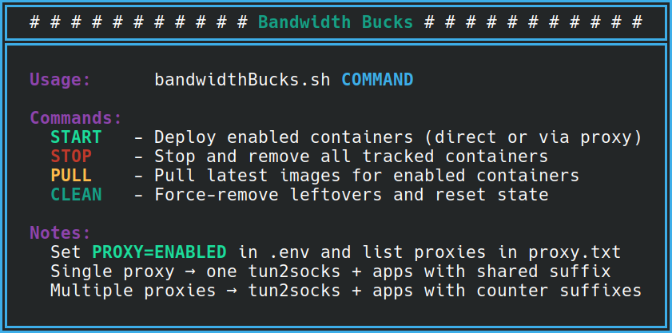

<div align="center">
  
</div>

# 🌐 BandwidthBucks 📶

- BandwidthBucks is a Linux automation script that lets you earn passive income by sharing your internet bandwidth through multiple containerized apps.
- It orchestrates Docker containers, manages proxies, applies kernel tuning, and ensures clean lifecycle management so you can focus on payouts instead of troubleshooting.
- The script supports direct mode (apps connect normally) and proxy mode (apps route through tun2socks + proxies).
- Your income depends on the number of apps enabled, ip/proxy quality, and demand.

## ✨ Features

- Multi-App Support: CastarSDK, PacketSDK, TraffMonetizer, UrNetwork, EarnFM, RePocket, Pawns, HoneyGain, PacketStream, Peer2Profit, Wipter.
- Proxy Integration: Supports single or multiple proxies via proxy.txt.
- Lifecycle Management: START, STOP, PULL, CLEAN commands with state tracking.
- Sysctl Hardening: Auto-applies kernel tuning for performance.
- Logging Control: Disable logs or rotate with size limits.
- Crash Recovery: Cleans orphaned containers and resets state.

## 📝 Registration Links

<div align="center">
  <table>
    <thead>
      <tr>
        <th align="center"> </th>
        <th align="center">Application</th>
        <th align="center">Residential IP</th>
        <th align="center">Datacenter IP</th>
      </tr>
    </thead>
    <tbody>
      <tr>
        <td align="center"><a href="https://www.castarsdk.com/register?c=c5b7ba22"></a></td>
        <td align="center"><a href="https://www.castarsdk.com/register?c=c5b7ba22">CastarSDK</a></td>
        <td align="center">✔️</td>
        <td align="center">✔️</td>
      </tr>
      <tr>
        <td align="center"><a href="https://packetsdk.com/?r=L2kDofIF"></a></td>
        <td align="center"><a href="https://packetsdk.com/?r=L2kDofIF">PacketSDK</a></td>
        <td align="center">✔️</td>
        <td align="center">✔️</td>
      </tr>
      <tr>
        <td align="center"><a href="https://traffmonetizer.com/?aff=92836"></a></td>
        <td align="center"><a href="https://traffmonetizer.com/?aff=92836">TraffMonetizer</a></td>
        <td align="center">✔️</td>
        <td align="center">✔️</td>
      </tr>
      <tr>
        <td align="center"><a href="https://ur.io/c?bonus=0MYG84"></a></td>
        <td align="center"><a href="https://ur.io/c?bonus=0MYG84">UrNetwork</a></td>
        <td align="center">✔️</td>
        <td align="center">✔️</td>
      </tr>
      <tr>
        <td align="center"><a href="https://earn.fm/ref/LERO0EVX"></a></td>
        <td align="center"><a href="https://earn.fm/ref/LERO0EVX">EarnFM</a></td>
        <td align="center">✔️</td>
        <td align="center">✔️</td>
      </tr>
      <tr>
        <td align="center"><a href="https://link.repocket.com/3KLE"></a></td>
        <td align="center"><a href="https://link.repocket.com/3KLE">RePocket</a></td>
        <td align="center">✔️</td>
        <td align="center">✔️</td>
      </tr>
      <tr>
        <td align="center"><a href="https://pawns.app/?r=an2kin"></a></td>
        <td align="center"><a href="https://pawns.app/?r=an2kin">Pawns</a></td>
        <td align="center">✔️</td>
        <td align="center">❌</td>
      </tr>
      <tr>
        <td align="center"><a href="https://join.honeygain.com/VILLA9A2E9"></a></td>
        <td align="center"><a href="https://join.honeygain.com/VILLA9A2E9">HoneyGain</a></td>
        <td align="center">✔️</td>
        <td align="center">❌</td>
      </tr>
      <tr>
        <td align="center"><a href="https://packetstream.io/?psr=PhF"></a></td>
        <td align="center"><a href="https://packetstream.io/?psr=PhF">PacketStream</a></td>
        <td align="center">✔️</td>
        <td align="center">❌</td>
      </tr>
      <tr>
        <td align="center"><a href="https://t.me/peer2profit_app_bot?start=1628962882611800423c343"></a></td>
        <td align="center"><a href="https://t.me/peer2profit_app_bot?start=1628962882611800423c343">Peer2Profit</a></td>
        <td align="center">✔️</td>
        <td align="center">✔️</td>
      </tr>
      <tr>
        <td align="center"><a href="https://wipter.com/register?via=66075F1E60"></a></td>
        <td align="center"><a href="https://wipter.com/register?via=66075F1E60">Wipter</a></td>
        <td align="center">✔️</td>
        <td align="center">❌</td>
      </tr>
      <tr>
        <td align="center"><a href="https://adnade.net/?ref=techroy23"></a></td>
        <td align="center"><a href="https://adnade.net/?ref=techroy23">AdNade</a></td>
        <td align="center">✔️</td>
        <td align="center">✔️</td>
      </tr>
      <tr>
        <td align="center"><a href="https://peer.proxybase.org?referral=m7L9vn5pTq"></a></td>
        <td align="center"><a href="https://peer.proxybase.org?referral=m7L9vn5pTq">ProxyBase</a></td>
        <td align="center">✔️</td>
        <td align="center">✔️</td>
      </tr>
    </tbody>
  </table>
</div>

## 🏗️ Prerequisites

- Linux host or Linux VM.
- Root privileges.
- Docker installed and running.
- Root user added to the docker group.
- For ARM/AARCH architectures, install binfmt/qemu to support amd64 images:
    ```bash
    sudo docker run --privileged --rm tonistiigi/binfmt --install all
    sudo apt-get install qemu binfmt-support qemu-user-static
    ```

## ⚙️ Setup

- Clone this repository:
    ```bash
    git clone https://github.com/techroy23/BandwidthBucks
    cd BandwidthBucks
    chmod +x bandwidthbucks.sh
    ```

- Create and edit .env with your account credentials:
    - Set ENABLED for apps you want to run.
    - Always wrap the var_ values in quotes.

- (Optional) Add proxies in proxy.txt if PROXY=ENABLED.
    - Supports http://, socks4://, socks5://.
    - One proxy per line.

## 📶 Usage

Run the script with one of the following commands:
<div align="center">
  
</div>

## ⚠️ Disclaimer

This project, BandwidthBucks, is provided strictly “as is” without any express or implied warranties of any kind. By using this script, you acknowledge and agree to the following:

- **No Warranty** : The author makes no guarantees regarding functionality, uptime, reliability, profitability, or fitness for any particular purpose.
- **Use at Your Own Risk** : You assume full responsibility for any outcomes, including but not limited to account suspensions, bans, financial loss, data loss, or system instability.
- **Compliance** : You are solely responsible for ensuring that your use of this script complies with all applicable local, national, and international laws, as well as the terms of service of each third‑party application, proxy provider, or network you connect to.
- **No Liability** : The author shall not be held liable for any direct, indirect, incidental, consequential, or punitive damages arising from the use or misuse of this script. This includes, but is not limited to, legal claims, regulatory penalties, or contractual disputes.
- **Third‑Party Services** : All trademarks, services, and applications referenced are the property of their respective owners.
- **Security & Privacy** : You are responsible for safeguarding your own credentials, API keys, and system security. The author does not collect, store, or manage your data.
- **Responsibility** : By using this script, you agree that the author cannot be held responsible for any claims, damages, costs, or legal issues that may come up from your use of it. If problems arise — whether financial, technical, or legal — you accept that it’s your responsibility, not the author’s.
